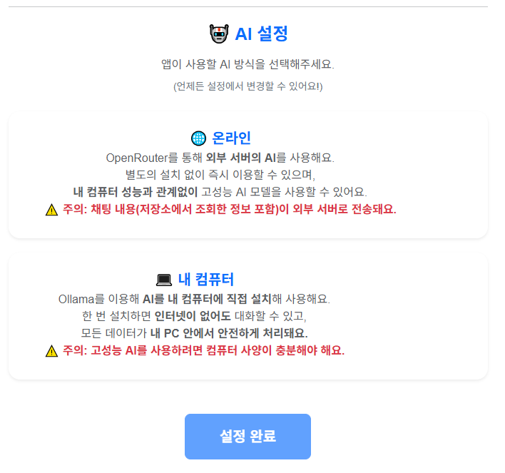
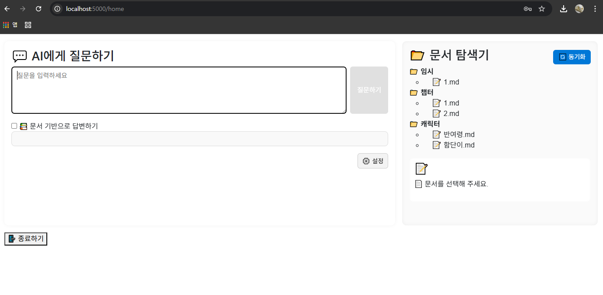
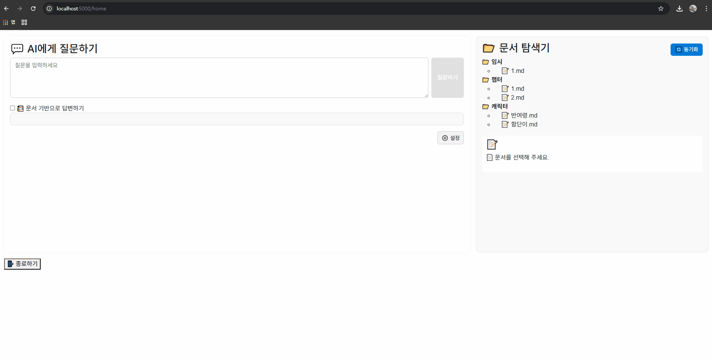

# 📌 **🧭 처음 사용하는 분들을 위한 빠른 시작 가이드**

Novel Assistant를 처음 실행하면,
프로그램이 **두 가지 초기 설정**을 안내합니다:

1. **Root Folder 선택**
2. **AI 모델 설정(Ollama 또는 OpenRouter)**

이 두 단계만 완료하면 바로 Home 화면으로 이동하여 사용할 수 있어요.


## 1️⃣ **Root Folder 선택하기**

Novel Assistant는 *로컬 폴더 안의 문서들을 기반으로* AI가 답변을 생성합니다.
따라서 처음 실행하면 아래와 같은 화면이 나타나며 **프로젝트의 루트 폴더**를 지정해야 합니다.

<div align="center">
  
</div>

* 이 폴더 안의 내용이 자동으로 분석되어 검색(RAG)에 사용됩니다.
* 예시는: `C:\MyNovelProject`
* 폴더를 선택한 뒤 **[폴더 확인]** 버튼을 눌러 진행합니다.

---

아래는 **두 번째 이미지(AI 설정 화면)**를 반영해,
README의 *AI 설정 설명 부분만* 수정한 완성 버전이야.
직관적이고, 실제 UI 문구와 자연스럽게 맞도록 정리했어.

## 2️⃣ **AI 설정하기 (온라인 또는 내 컴퓨터)**

Root Folder를 선택하면 이어서 **AI를 어떤 방식으로 사용할지 선택하는 화면**이 나타납니다.

<div align="center">
  
</div>

Novel Assistant는 다음 두 방식 중 하나로 AI를 사용할 수 있습니다.

---

### 🌐 **온라인(OpenRouter 사용)**

외부 AI 서버(OpenRouter)를 이용하여 실행합니다.

* 별도 설치 없이 바로 사용 가능
* PC 성능과 관계없이 고성능 모델 사용 가능
* 인터넷 연결 필요

⚠ **주의:**
대화 내용(루트 폴더 내 데이터를 기반으로 생성된 요청 포함)이 **외부 서버로 전송**됩니다.
민감한 내용을 사용할 경우 주의해 주세요.

---

### 💻 **내 컴퓨터(Ollama 사용)**

AI 모델을 PC에 직접 설치하여 로컬에서 실행합니다.

* 설치 후에는 인터넷 없이도 사용 가능
* 모든 데이터가 **PC 내부에서만 처리**되어 보안이 높음
* PC 성능에 따라 지원 가능한 모델이 달라짐

⚠ **주의:**
고성능 모델을 사용할 경우 **컴퓨터 사양이 충분해야** 제대로 동작합니다.

아래는 **Home 화면 설명을 포함한 README 업데이트 버전**이야.
초기 설정 이후 흐름을 자연스럽게 이어서,
유저가 실제 사용법을 바로 이해할 수 있도록 구성했어.

GIF를 추가할 부분도 플레이스홀더로 표시해둠.


# 3️⃣ **Home 화면 — 문서 기반 AI 어시스턴트**

초기 설정이 완료되면 아래와 같은 **Home 화면**이 나타납니다.
이곳에서 문서를 탐색하거나, AI에게 질문하며 작업을 진행할 수 있습니다.

<div align="center">
  
</div>


## 📁 **문서 탐색기 (Root Folder 기반)**

* 좌측에 선택한 **Root Folder 구조가 그대로 표시**됩니다.
* 폴더와 파일(.md 등)을 선택하면 우측 패널에서 내용을 미리 볼 수 있습니다.
* 예시로는 `인소의 법칙` 캐릭터 관련 문서들이 들어있습니다.

예시 구조:

```
임시
 └─ 1.md
챕터
 ├─ 1.md
 └─ 2.md
캐릭터
 ├─ 반여령.md
 └─ 함단이.md
```

## 💬 **AI에게 질문하기**

화면 왼쪽 상단에서는 일반적인 챗봇처럼 일반 상식 질문도 자유롭게 할 수 있습니다.
문서 기반 체크를 끄면, 일반적인 지식 질문에 대한 답변을 바로 받을 수 있습니다.

질문 예시:

```
대한민국의 수도는 뭐야?
```

또는

```
세상에서 가장 높은 산은?
```


## 📚 **문서 기반으로 답변하기 (RAG 기능)**

질문 입력 아래의 **“📚 문서 기반으로 답변하기”** 체크박스를 활성화하면,

> 질문 → 관련 문서 자동 조회 → AI가 문서 내용을 기반으로 답변

하는 RAG 방식으로 동작합니다.

즉, **Root Folder 안의 문서들을 지식베이스처럼 활용**하여 더 정확한 답변을 제공합니다.

예시:

```
문서 기반으로 답변하기 ✔
"함단이의 말투 특징을 알려줘."
→ 캐릭터/함단이.md 파일에서 자동으로 내용 검색 후 답변
```

## 🎥 사용 예시

아래 GIF는 Novel Assistant가 **문서 기반으로 답변하는 전체 흐름**을 보여줍니다.

<div align="center">
  
</div>

**동작 흐름**

1. 문서를 선택하고
2. **"문서 기반으로 답변하기"** 체크 후
3. 질문을 입력하면
4. AI가 해당 문서 내용을 기반으로 답변을 생성합니다.

---

## 🚀 이제 바로 사용해보세요!

* 문서가 많을수록 AI의 답변이 더 풍부해집니다.
* 소설, 설정집, 캐릭터 시트, 세계관 노트 등 어떤 텍스트 파일이든 활용할 수 있습니다.
* Root Folder를 자유롭게 구성하여 자신만의 세계관 기반 AI 어시스턴트를 만들 수 있어요.
