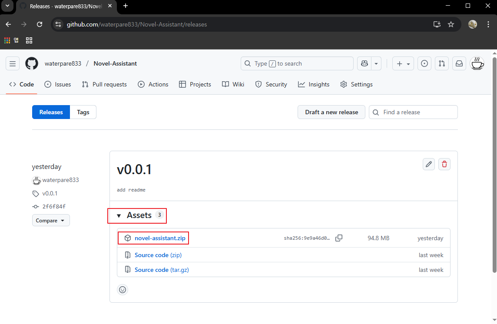
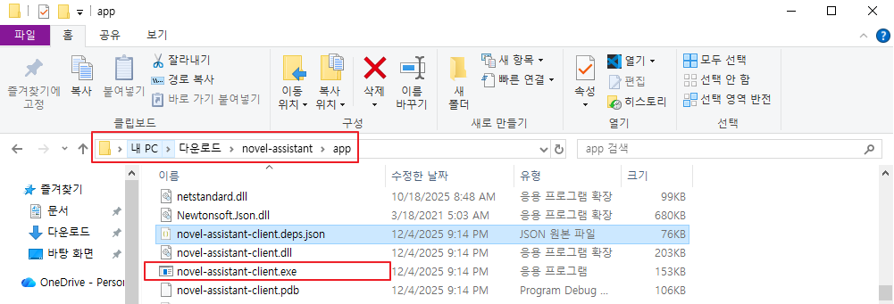
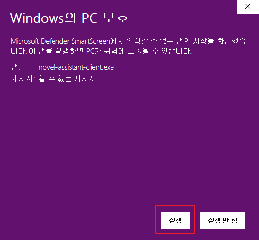
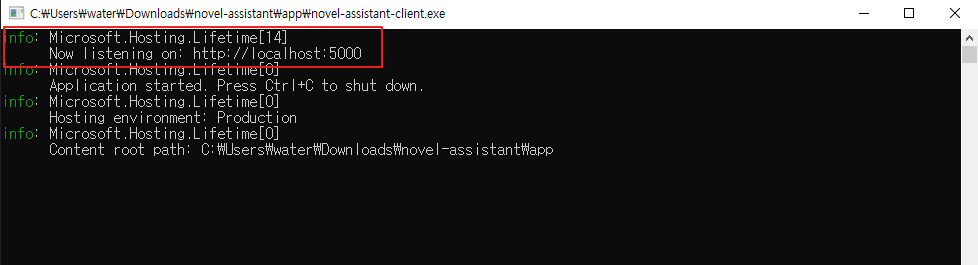

# 📌 **📥 Novel Assistant 다운로드 & 실행 방법**

## 1️⃣ 다운로드하기

1. 아래 링크를 클릭해 Releases 페이지로 이동하세요.  
   👉 **https://github.com/waterpare833/Novel-Assistant/releases**

2. 페이지에서 **Assets** 영역을 펼치면 `NovelAssistant.zip` 파일이 보입니다.  
   이 파일을 클릭하여 다운로드해 주세요.

   

     
   

---

## 2️⃣ 설치하기 (압축 풀기)

다운로드가 완료되면 ZIP 파일을 압축 풀어야 합니다.

1. 다운로드한 `NovelAssistant.zip` 파일을 **마우스 오른쪽 버튼으로 클릭**합니다.
2. 메뉴에서 **“Novel-Assistant에 압축 풀기”** 또는 **“Extract All(모두 추출)”**을 선택하세요.  
   (Windows 버전이나 압축 프로그램에 따라 문구가 조금 다를 수 있습니다.)
3. 압축이 풀리면 폴더가 생성되며, 그 안에서 실행 파일을 사용하게 됩니다.

  

💡 *참고:*  
압축을 풀지 않고 ZIP 파일 안에서 실행하면 오류가 발생할 수 있으니  
**반드시 압축을 먼저 풀고 실행해 주세요.**

---

## 3️⃣ 실행하기

압축을 풀면 아래와 같은 폴더 구조가 만들어집니다:

novel-assistant/

└─ app/

└─ updater/

실행 방법은 다음과 같아요:

1. 압축이 풀린 폴더에 들어갑니다.
2. **`app` 폴더**를 엽니다.
3. 그 안에 있는 **`novel-assistant-client.exe`** 파일을 더블 클릭하여 실행합니다.

  

---

### 🛡 Windows에서 “PC 보호” 창이 뜨는 경우

처음 실행하는 프로그램이라서, Windows에서 안전을 위해 경고창이 뜰 수 있어요.  
이 경우 아래 순서대로 진행하면 됩니다.

1. **“Windows의 PC 보호”** 또는 비슷한 제목의 창이 나타나면,  
   바로 실행 버튼이 보이지 않고 대신 **“추가 정보”** 라는 파란 글자가 보일 거예요.  
   그때 **“추가 정보”** 를 클릭해 주세요.

   

     
   

2. “추가 정보”를 누르면 아래쪽에 **“실행” 버튼**이 새로 나타납니다.  
   이 버튼을 클릭하면 Novel Assistant를 정상적으로 실행할 수 있어요.

   

     
   

> 💡 이 경고는 “처음 보는 프로그램이라서” 나오는 일반적인 안내일 뿐이고,  
> 파일이 손상되었다는 뜻은 아니에요.  
> 신뢰할 수 있는 출처(이 GitHub 릴리즈)에서 받은 파일이라면 위와 같이 실행해도 괜찮습니다.

---

### 🌐 실행 후 접속 방법

프로그램을 실행하면 **검은색 콘솔 창**이 열립니다.  
이 창은 Novel Assistant의 서버 역할을 하며, 정상적으로 실행되면 다음 주소에서 앱을 사용할 수 있어요:

👉 **http://localhost:5000**

원하는 브라우저(Chrome, Edge 등)를 열고 위 주소로 접속해 주세요.

   

     
   

그러면 Novel Assistant 웹 인터페이스가 표시되며,  
바로 사용을 시작할 수 있습니다! 🚀

> ⚠️ 콘솔 창은 프로그램이 동작하는 동안 반드시 켜져 있어야 합니다.  
> 콘솔을 닫으면 Novel Assistant도 함께 종료됩니다.

---

## ⚠️ 중요한 안내

Novel Assistant는 AI 기능을 사용하기 위해
**Docker Desktop 설치가 반드시 필요합니다.**

Docker가 설치되지 않았다면 프로그램이 자동으로 안내해 줍니다.

---

## 4️⃣ 첫 실행 시 필요한 설정

앱을 처음 실행하면 다음을 설정해야 합니다:

* **Root 폴더 선택** (소설 프로젝트 폴더)
* **AI 사용 방식 선택**

  * OpenRouter
  * 또는 로컬 AI(Ollama)
* 필요한 모델 설치 또는 API Key 입력

앱에서 차근차근 안내해 드립니다 😊

---

## 🙋 문제 해결

문제가 생기면 Issues 탭에 문의해주세요:
👉 [https://github.com/waterpare833/Novel-Assistant/issues](https://github.com/waterpare833/Novel-Assistant/issues)

---

# 🎉 이제 바로 사용할 수 있습니다!

여러분의 창작을 돕기 위해 정성껏 만들었습니다.

재미있게 사용해 주세요!